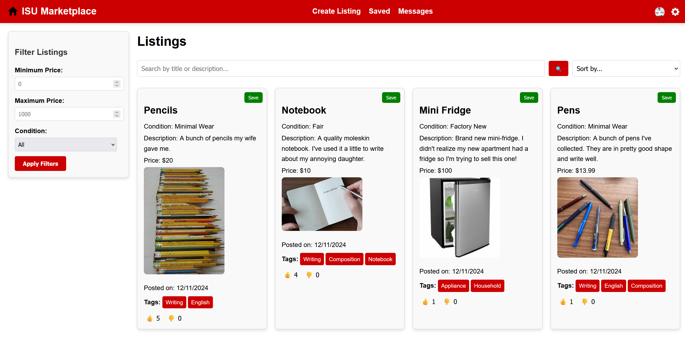
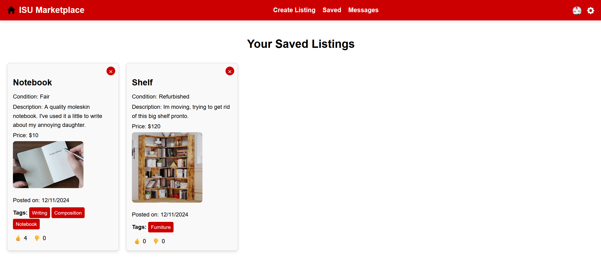
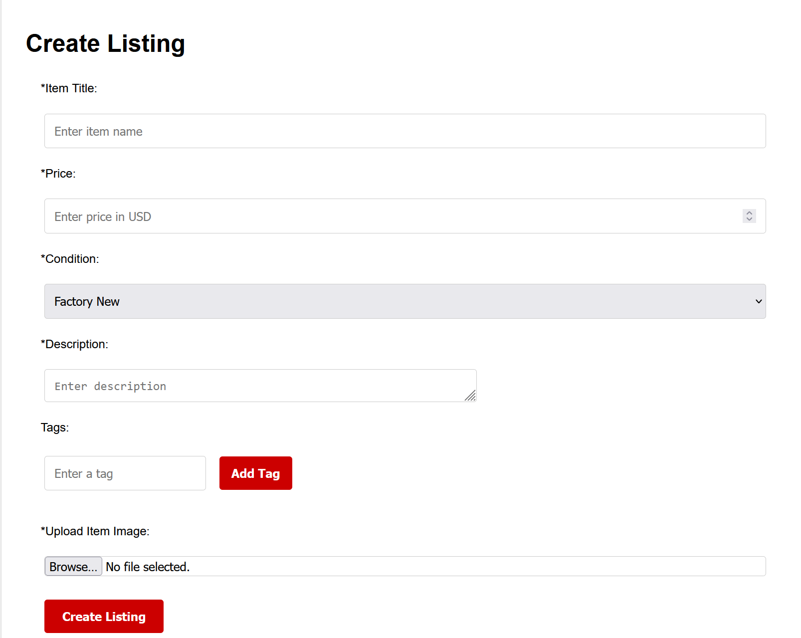
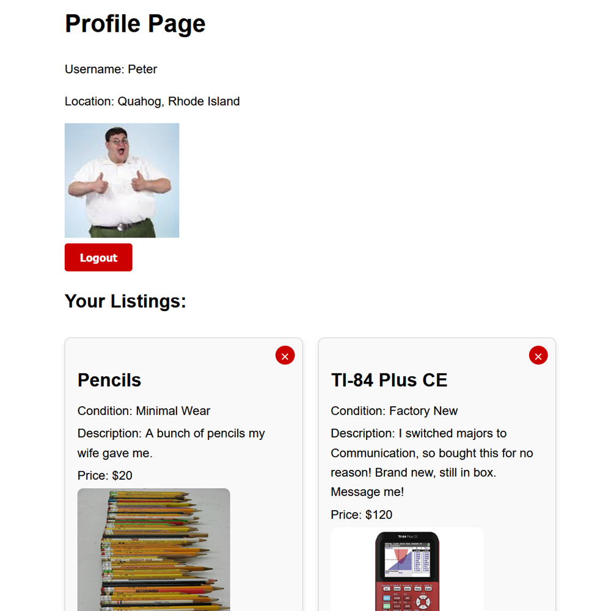
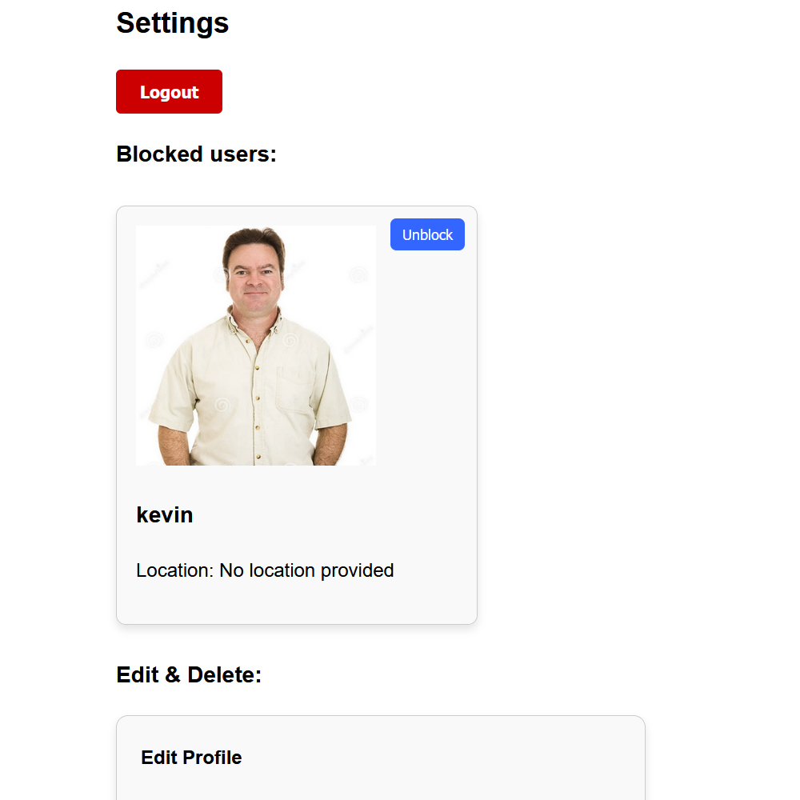
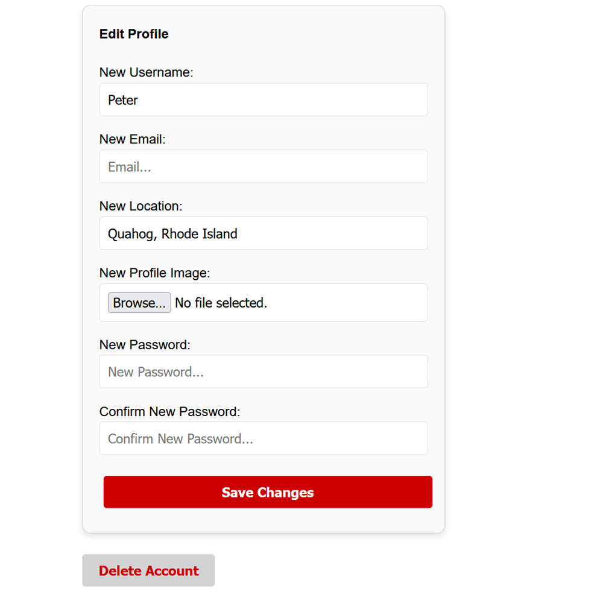
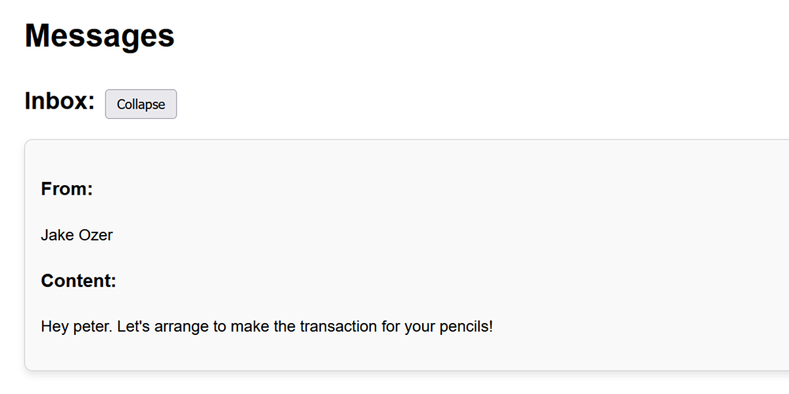

<!-- ABOUT THE PROJECT -->
## About The Project
<div align="center">
  <a href="https://github.com/bennettbDEV/CollegeMarketplace">
    
  </a>
</div>
With the abundance of irrelevant and distant listings on classified advertising platforms such as Facebook Marketplace and Craigslist, our team decided to develop an open-source marketplace platform tailored to students.
To achieve this goal and learn as much as possible about critical tools in the software industry, we chose to develop the platform using Django Rest Framework (Python) for the backend API, and React + Vite (JavaScript/JSX) for the frontend.
<br/><br/>

**Implementation Information**
<br/>
Although unconventional, our professor (project advisor) suggested that we avoid using Django's Object Relational Mapper (ORM) to gain hands-on experience with raw SQL. While this made the project more challenging, it gave us valuable experience in creating and managing the database ourselves. It also pushed us to spend more time exploring Django and Django Rest Framework’s documentation, helping us better understand how they work.

<br/><br/>

**Image Showcase**
<br/>
Here are some screenshots showing different pages from our frontend:
<div>
  <a>
    
    
    
    
    
    
  </a>
</div>

## Documentation
To access our REST API documentation you can download the schema from [backend/schema.yaml](backend/schema.yaml) or run the backend server (Follow the **Try Our Code** section) and open a browser to "http://localhost:8000/" or "http://localhost:8000/api/"

## Features
Our project includes all the vital features of an online marketplace, and more! Some of our notable features are below:
- Secure authentication using JSON Web Tokens (JWT)
- Comprehensive account management: creation, retrieval, updates, and deletion
- Listing management with filtering, searching, sorting, and saving for later access
- Messaging capabilities: sending, retrieving, and deleting messages
- User interaction features: liking/disliking listings and blocking/unblocking other users

## Try our code!
To install the dependencies and run the project as it is now, follow these simple steps in your terminal:

0. Prerequisites:
Install [Node.js](https://nodejs.org/en/download/package-manager)(version 20 or newer) and [Python](https://www.python.org/downloads/)(version 3.10 or newer)
1. Clone the repo (into the currect directory)
```sh
git clone https://github.com/bennettbDEV/CollegeMarketplace.git .
```
2. (Optionally) Set up a [virtual environment](https://www.freecodecamp.org/news/how-to-setup-virtual-environments-in-python/)
```sh
python -m venv venv
```
2a. Activate the virtual environment - for Windows:
```sh
.\venv\Scripts\activate
```
2b. Activate the virtual environment - for Linux/Mac:
```sh
source venv/bin/activate
```
3. Move to the backend directory 
```sh
cd backend
```
4. Install necessary packages
```sh
python -m pip install -r requirements.txt
```
5. Navigate back to the base directory
```sh
cd ..
```
6. Go to the frontend directory
```sh
cd frontend
```
7. Install necessary packages
```sh
npm install
```
8. Create an env file (Links our development servers together)
```sh
echo VITE_API_URL="http://localhost:8000/" > .env
```
**Run the servers** <br/>
9. Start the frontend
```sh
npm run dev
```
10. After splitting or creating a new terminal, navigate to CollegeMarketplace/backend
```sh
cd ..
cd backend
```
11. Start the backend
```sh
python manage.py runserver
```
12. Done!
    Open a browser and enter "http://localhost:5173/" into the search bar to interact with the Marketplace
